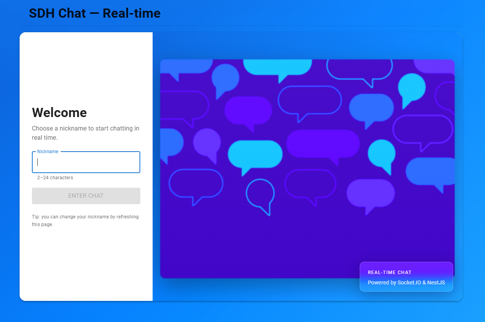
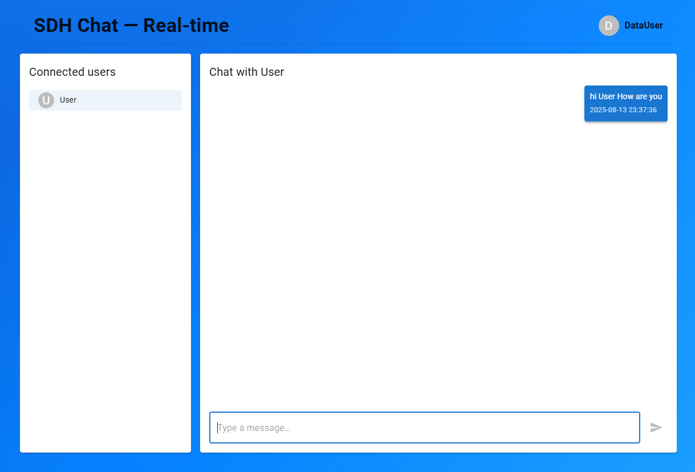
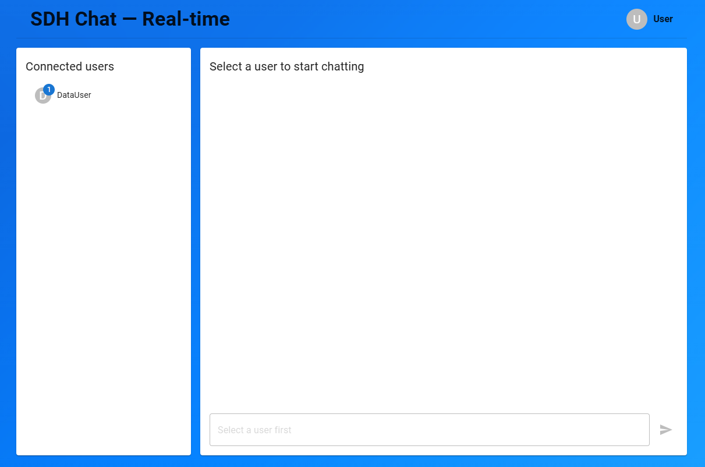
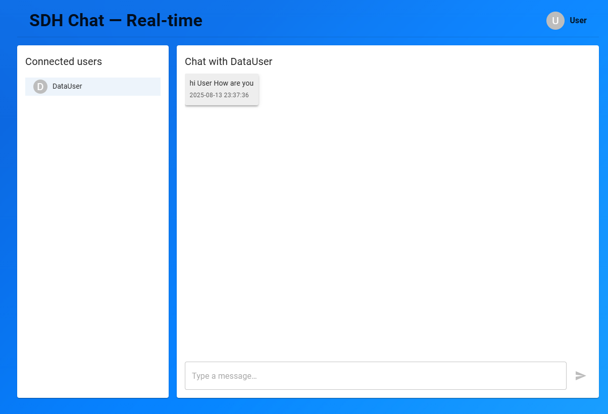

# SDH Chat — README

> **Chat en tiempo real** con **React + Vite + TypeScript + Material UI** (frontend) y **NestJS + Socket.IO** (backend).
> Incluye UI estilo *glass/blue*, nicks únicos (con sufijos `(... )` si se repiten), badge con **no leídos**, y **Swagger** para endpoints HTTP.

<p align="center">
  
</p>

<p align="center">
  
</p>

<p align="center">
  
</p>

<p align="center">
  
</p>

---

## ✨ Características

- 🔵 **Tiempo real** con Socket.IO
- 👤 **Nicks únicos:** si un nick existe, el servidor asigna `Nick (2)`, `Nick (3)`, etc.
- 🔔 **No leídos por usuario:** se incrementan cuando llega un mensaje y el chat no está abierto; se limpian al abrir ese chat
- ⏱️ **Timestamps** por mensaje
- 🧊 **UI glass/blue** + **avatar** del usuario actual en el header
- 📚 **Swagger** en `http://localhost:3000/api` para probar endpoints HTTP
- 🧩 Código **TypeScript** con **ESLint/Prettier**, `.env` de ejemplo y **Dockerfile** para el backend

---

## 🏗️ Arquitectura rápida

- **Frontend (Vite + React + TS + MUI)**
  - Conecta al backend via `socket.io-client`
  - Maneja lista de usuarios, conversación activa, envío de mensajes
  - *No duplica mensajes*: el cliente **no** inserta localmente, espera el eco del servidor (con timestamp uniforme)

- **Backend (NestJS + Socket.IO)**
  - `ChatGateway`: conexión de sockets, broadcast de usuarios, mensajes privados
  - `ChatService`: usuarios en memoria y simple historial; normaliza nicks para que sean únicos
  - Emite `nick_assigned` al conectar para informar el nick final

---

## 🚀 Arranque rápido (local)

### 1) Backend
```bash
cd sdh-chat-backend
yarn
cp .env.example .env
# Ajusta si necesitas:
# PORT=3000
# CORS_ORIGIN=http://localhost:5173
yarn start:dev
# Swagger: http://localhost:3000/api
```

### 2) Frontend
```bash
cd sdh-chat-frontend
yarn
cp .env.example .env
# VITE_BACKEND_URL=http://localhost:3000
yarn dev
# Abre: http://localhost:5173
```

> **Tip:** Abre 2 pestañas, inicia con nicks distintos y prueba el chat 1–1. Si alguien te escribe y no estás en ese chat, verás el **contador de no leídos**.

---

## ⚙️ Variables de entorno

**Backend (`.env`)**
```dotenv
PORT=3000
CORS_ORIGIN=http://localhost:5173
```

**Frontend (`.env`)**
```dotenv
VITE_BACKEND_URL=http://localhost:3000
```

---

## 🧪 Endpoints y eventos

**Swagger (HTTP):** `http://localhost:3000/api`  
Incluye, por ejemplo:
- `GET /health` — ping
- `GET /users` — lista de usuarios conectados
- `POST /messages/send` — envía un mensaje *desde el servidor* a un `socketId` (útil para pruebas)

**WebSocket (Socket.IO):**
- `users` — lista de usuarios conectados (sin incluir al cliente)
- `private_message` — intercambio 1–1 `{ from, to, content, timestamp }`
- `nick_assigned` — nick definitivo asignado al conectar (`{ id, nick }`)

---

## 🧰 Scripts útiles

**Frontend**
```bash
yarn dev       # desarrollo
yarn build     # build producción
yarn preview   # servir build de producción
yarn lint      # ESLint
```

**Backend**
```bash
yarn start:dev # desarrollo (watch)
yarn build     # compilar a dist/
yarn start     # producción
yarn lint      # ESLint
```

**Docker (backend)**
```bash
docker build -t sdh-chat-backend .
docker run -p 3000:3000 --env-file .env sdh-chat-backend
```

---

## 📦 Estructura sugerida del repo

```
Test-Konecta/
├─ sdh-chat-frontend/         # Vite + React + TS + MUI
│  ├─ src/
│  ├─ .env.example
│  └─ ...
├─ sdh-chat-backend/          # NestJS + Socket.IO
│  ├─ src/
│  ├─ .env.example
│  └─ ...
└─ README.md                  # Este archivo
```
